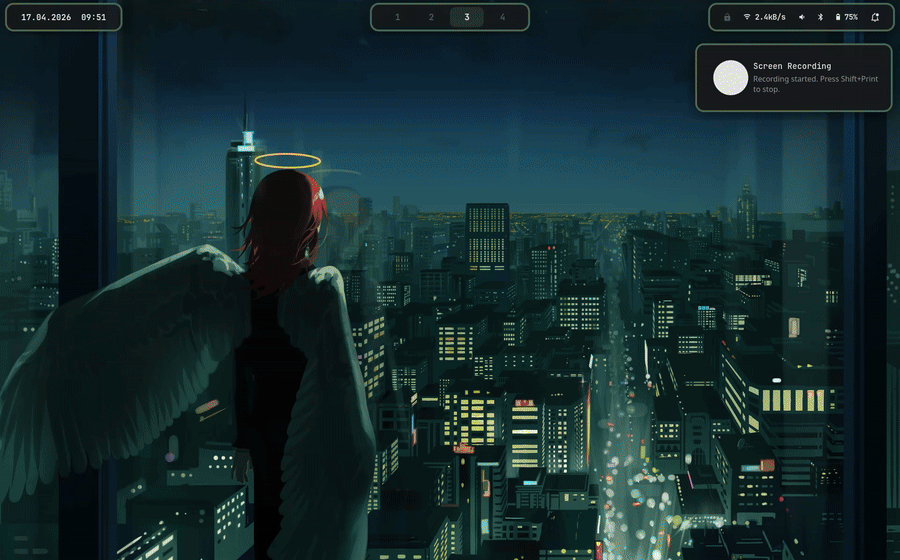
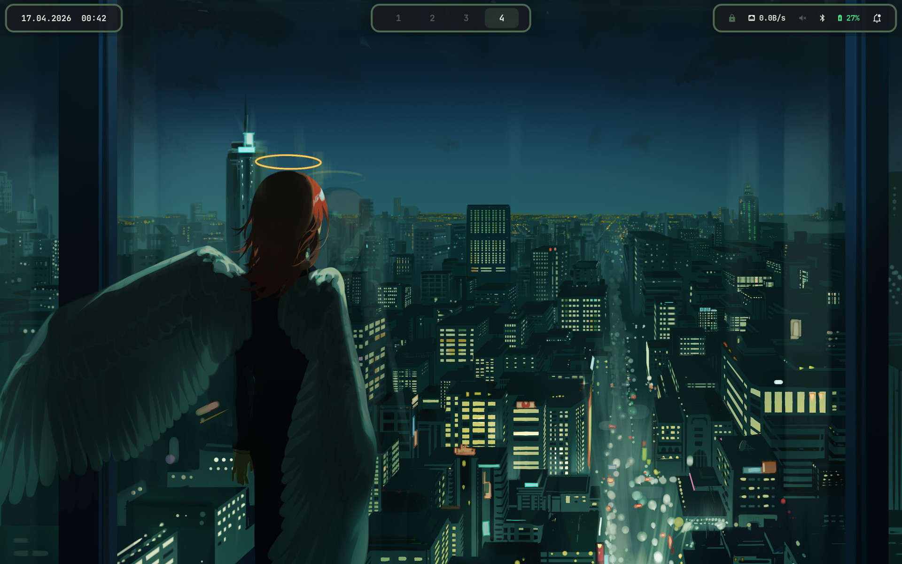
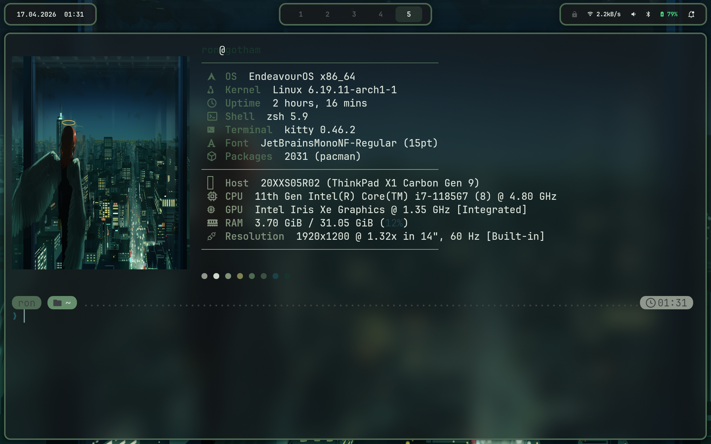

<div align="center">

<h1>dotfiles</h1>

<p><em>Arch Linux · Niri · Quickshell · Wayland-native · Dynamic Wallust theming</em></p>

<p>
  
  
  
  
</p>

<p>
  
  
  
  
</p>

<p>
  
</p>

<p>
  Scrollable tiling on <a href="https://github.com/YaLTeR/niri">niri</a>, custom shell built in
  <a href="https://quickshell.outfoxxed.me/">Quickshell</a>. Every wallpaper change regenerates
  the full color scheme — borders, bar, OSD, lock screen — live, with zero manual intervention.
</p>

</div>

---

## Screenshots

### Overview

<div align="center">
  
</div>

<table>
  <tr>
    <td align="center"><strong>Desktop Overview</strong></td>
    <td align="center"><strong>Terminal + Fastfetch</strong></td>
  </tr>
  <tr>
    <td></td>
    <td></td>
  </tr>
</table>

---

## What Makes This Setup Different

### Scrollable Tiling (Niri)

Windows live in **columns** on an infinite horizontal strip. The screen is a viewport you scroll
through, not a grid that fills automatically. Each column can stack multiple windows vertically,
each monitor has its own independent workspace list. See `.config/niri/README.md` for the full
keybind reference.

### Quickshell Custom Shell

Bar, OSDs, lock screen, power menu, wallpaper picker, notifications — all written from scratch in
QML under `.config/quickshell/`. Single design language: rounded pills, slide-in/out animations
flush with the screen edge, pywal-driven colors throughout.

| Component | File |
|---|---|
| Top bar (workspaces · window title · MPRIS · tray · clock) | `bar/Bar.qml` |
| Volume / Brightness OSD (right edge slide-in) | `osd/Osd.qml` |
| Lock screen (separate qs instance, IPC-triggered) | `lock/` |
| Power menu (`Super+Shift+L`) | `menus/PowerMenu.qml` |
| Wallpaper picker (`Super+G`) | `menus/WallpaperPicker.qml` |
| Notification center | `NotifState.qml` + panel |

### Dynamic Theming Pipeline

One command — `wallust run wallpaper.jpg` — propagates a full 16-color scheme derived from the
wallpaper to every component simultaneously. No manual color picking, no config edits.

```
Wallpaper
   │
   ▼
wallust run wallpaper.jpg
   │
   ├──▶ Kitty terminal       (.config/wallust/templates/colors-kitty.conf)
   ├──▶ Quickshell colors    (Colors.qml — bar, OSD, menus, lock)
   ├──▶ Niri borders         (pywal-niri-colors.sh → niri msg)
   ├──▶ Starship prompt      (starship-color-gen.sh)
   ├──▶ Yazi theme           (theme.toml)
   └──▶ Zen Browser          (zen-wal-refresh.sh)
```

Color templates live in `.config/wallust/templates/` — edit them to customize which color roles
map to which UI elements.

### AI + MCP Integration

`Super+A` opens the AI assistant inside the Quickshell launcher (`ai ` mode — Gemini SSE
streaming, multi-turn history). `Super+M` opens the MCP Manager floating window — full
catalog/servers/clients/tools/secrets/gateway UI implemented in Quickshell over `docker mcp`.

### Dynamic Monitor Profiles (kanshi)

`kanshi` automatically switches between docked and laptop-only display configurations based on
connected outputs. Machine-specific monitor config (`~/.config/kanshi/config`) is intentionally
not tracked in this repo.

---

## Stack

| Component | Tool |
|-----------|------|
| Compositor | [niri](https://github.com/YaLTeR/niri) (scrollable tiling) |
| Shell / Bar / OSD / Lock | [Quickshell](https://quickshell.outfoxxed.me/) (custom QML) |
| Terminal | [Kitty](https://sw.kovidgoyal.net/kitty/) |
| Shell | ZSH + [Oh My ZSH](https://ohmyz.sh/) + [Starship](https://starship.rs/) |
| Editor | [Neovim](https://neovim.io/) (LazyVim) |
| Code Editor (GUI) | [Zed](https://zed.dev/) |
| Launcher / AI / MCP | Quickshell launcher + MCP Manager (custom QML) |
| Color Theming | [Wallust](https://codeberg.org/explosion-mental/wallust) (pywal-compatible) |
| Wallpaper | [awww](https://github.com/LGFae/awww) / swaybg fallback |
| Idle daemon | [swayidle](https://github.com/swaywm/swayidle) |
| Monitor Mgmt | [kanshi](https://sr.ht/~emersion/kanshi/) |
| Notifications | Quickshell `NotifState` (D-Bus) |
| File Manager | [Yazi](https://yazi-rs.github.io/) (TUI) / Nautilus (GUI) |
| Browser | [Zen Browser](https://zen-browser.app/) |
| Git TUI | [Lazygit](https://github.com/jesseduffield/lazygit) |
| Multiplexer | [Tmux](https://github.com/tmux/tmux) |
| System Info | [Fastfetch](https://github.com/fastfetch-cli/fastfetch) |

---

## Keybindings

> Full reference: `.config/niri/README.md`. Summary below.

### Applications

| Keybind | Action |
|---------|--------|
| `Super + T` | Terminal (Kitty) |
| `Super + B` | Browser (Zen) |
| `Super + Shift + B` | Browser (Private) |
| `Super + C` | Code Editor (Zed) |
| `Super + D` | Discord |
| `Super + N` | Notes (Obsidian) |
| `Super + Shift + N` | Document Editor (LibreOffice) |
| `Super + E` | File Manager (Yazi — floating) |
| `Super + Shift + E` | File Manager (Nautilus) |
| `Super + Shift + T` | Taskwarrior (floating) |
| `Super + Space` | App Launcher (Quickshell) |

### Menus / Tools

| Keybind | Action |
|---------|--------|
| `Super + G` | Wallpaper Picker (Quickshell) |
| `Super + Shift + S` | Next Wallpaper |
| `Super + Shift + G` | Random Wallpaper |
| `Super + Shift + L` | Power Menu (Quickshell) |
| `Super + V` | Clipboard History |
| `Super + A` | AI Assistant (Quickshell launcher `ai ` mode) |
| `Super + M` | MCP Server Manager (Quickshell floating window) |
| `Super + Y` | Pick color (niri pick-color → wl-copy + toast) |

### System

| Keybind | Action |
|---------|--------|
| `Super + Alt + L` | Lock Screen (Quickshell) |
| `Super + Shift + P` | Turn off monitors |
| `Super + F1` | Show all keybinds overlay |
| `Super + O` | Overview (zoomed-out workspaces) |
| `Super + F9` | Night Mode (4500K) |
| `Super + F10` | Night Mode (3000K) |
| `Super + Shift + F9` | Night Mode Off |
| `Print` | Screenshot UI (area select) |
| `Ctrl + Print` | Screenshot full screen |
| `Alt + Print` | Screenshot focused window |
| `Shift + Print` | Screen recording |
| `Ctrl + Alt + Delete` | Quit niri |

### Window / Column Management (niri-specific)

| Keybind | Action |
|---------|--------|
| `Super + Q` | Close Window |
| `Super + F` | Fullscreen |
| `Super + Shift + F` | Maximize column |
| `Super + Shift + M` | True maximize (no gaps) |
| `Super + Shift + V` | Toggle floating/tiling |
| `Super + H/J/K/L` (or arrows) | Focus column / window |
| `Super + Ctrl + H/J/K/L` | Move column / window |
| `Super + 1–9, 0` | Switch workspace |
| `Super + Shift + 1–9, 0` | Move window to workspace |
| `Super + Ctrl + R` | Cycle preset widths (1/3 → 1/2 → 2/3) |
| `Super + - / =` | Shrink / grow column width |
| `Super + ,` | Pull next window into column (stack) |
| `Super + .` | Expel bottom window from column |
| `Super + WheelUp/Down` | Scroll workspaces |

### Media Keys

| Key | Action |
|-----|--------|
| Volume Up/Down/Mute | Audio (Quickshell OSD via wpctl) |
| Mic Mute | Microphone |
| Brightness Up/Down | Screen brightness (Quickshell OSD via brightnessctl) |
| Play/Pause/Next/Prev | Media control (playerctl) |

---

## Installation

> **Prerequisites:** Arch Linux with a working Wayland session. Running `stow .` before
> installing dependencies will create broken symlinks.

### 1. Install dependencies

**pacman:**
```bash
sudo pacman -S niri kitty neovim yazi zsh starship tmux jq \
  swaybg swayidle kanshi nautilus gum fzf plocate \
  brightnessctl playerctl wl-clipboard cliphist wl-clip-persist \
  grim slurp \
  bluez bluez-utils networkmanager gnome-keyring \
  fastfetch lazygit btop
```

**AUR (yay):**
```bash
yay -S quickshell-git awww-bin wallust oh-my-zsh-git zsh-you-should-use \
  zen-browser-bin taskwarrior-tui
```

**Oh My ZSH plugins:**
```bash
git clone https://github.com/zsh-users/zsh-autosuggestions \
  ${ZSH_CUSTOM:-~/.oh-my-zsh/custom}/plugins/zsh-autosuggestions

git clone https://github.com/zsh-users/zsh-syntax-highlighting \
  ${ZSH_CUSTOM:-~/.oh-my-zsh/custom}/plugins/zsh-syntax-highlighting

git clone https://github.com/MichaelAquilina/zsh-you-should-use \
  ${ZSH_CUSTOM:-~/.oh-my-zsh/custom}/plugins/you-should-use

git clone https://github.com/fdellwing/zsh-bat \
  ${ZSH_CUSTOM:-~/.oh-my-zsh/custom}/plugins/zsh-bat
```

### 2. Clone & stow

```bash
git clone https://github.com/rs3c/dotfiles.git ~/dotfiles
cd ~/dotfiles
stow .
```

### 3. Set ZSH as default shell

```bash
chsh -s $(which zsh)
```

### 4. Set your wallpaper and generate colors

```bash
wallust run /path/to/wallpaper.jpg
```

This generates color schemes for niri borders, Quickshell, Kitty, Starship and Yazi —
automatically.

### 5. Monitor config (machine-specific, not tracked)

Create `~/.config/kanshi/config`:

```
profile docked {
    output eDP-1 disable
    output DP-1 mode 2560x1440@144Hz position 0,0 scale 1
}

profile laptop {
    output eDP-1 mode preferred scale 1.333
}
```

### 6. Face icon for lock screen (optional)

```bash
cp your-photo.jpg ~/.face.icon   # rendered by quickshell lock surface
```

---

## Structure

```
dotfiles/
├── .config/
│   ├── niri/
│   │   ├── config.kdl               # Compositor config (input, layout, keybinds, rules)
│   │   └── README.md                # Full niri keybind reference
│   ├── quickshell/
│   │   ├── shell.qml                # Main shell entry (bar, OSDs, menus)
│   │   ├── Theme.qml                # Animation/radius/spacing constants
│   │   ├── Colors.qml               # Generated by wallust (gitignored)
│   │   ├── bar/                     # Top bar pills
│   │   ├── osd/                     # Volume / Brightness OSD
│   │   ├── menus/                   # Power, Wallpaper, Clipboard, …
│   │   ├── launcher/                # (in progress)
│   │   ├── lock/                    # Separate qs instance for lock surface
│   │   └── *State.qml               # Audio / MPRIS / Network / Notif / Niri
│   ├── kanshi/                      # Monitor profiles (not tracked)
│   ├── fastfetch/                   # System info display
│   ├── kitty/                       # Terminal
│   ├── nvim/                        # Neovim (LazyVim)
│   ├── scripts/
│   │   ├── pywal-niri-colors.sh     # niri border color refresh hook
│   │   ├── qs-osd.sh                # OSD IPC trigger (bound from niri)
│   │   ├── wallpaper_switcher.sh    # Backend for qs wallpaper picker (apply/next/prev/random)
│   │   ├── pick-color.sh            # niri pick-color → wl-copy + toast
│   │   └── installer/               # Package installer helpers (yay-in-kitty)
│   ├── starship/                    # Shell prompt + wallust palette
│   ├── tmux/                        # Terminal multiplexer
│   ├── wallust/
│   │   └── templates/               # Color templates for each component
│   ├── yazi/                        # TUI file manager
│   └── zed/                         # Code editor (settings.json gitignored)
├── .zshrc
├── .zprofile
├── LICENSE
└── .stow-local-ignore
```

---

## Notes

- `zed/settings.json` is gitignored — it contains API keys. Copy `settings.json.example` as a
  starting point.
- `quickshell/Colors.qml` is generated by `wallust run` and gitignored.
- Monitor config (`kanshi/config`) is machine-specific and not tracked.
- The Tmux prefix is `Ctrl+Space` (not the default `Ctrl+B`).
- Wallust templates in `.config/wallust/templates/` define which color roles map to which UI
  variables — edit these to customize color behavior without changing any app config.
- Generated files (Quickshell `Colors.qml`, Yazi theme) are excluded from stow — they are created
  on first `wallust run`.
- This setup is mid-migration from Hyprland → niri/Quickshell. See `TODO.md` for open work.
